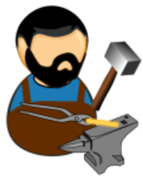
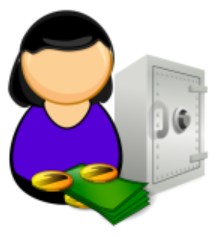
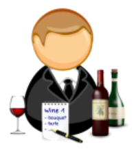

# Users
The following user profils interact with the system:

.User profiles
[frame="topbot",options="header"]
|===
| Nom | Icône | Rôle
| Adrian |  | Administrator
| Charles |  | Chef
| Clay |  | Customer
| Samantha |  | Manager
| William |  | Waiter
|===

# Functional domains

The functional domains covered by the system are the following:

.Domains
[frame="topbot",options="header"]
|===
| Code | Name
| RES | Restaurant
| BOK | Booking
| MEN | Menus
| ORD | Orders
| STO | Stock
|===

# Features

The features provided by the system are the following:

.Features
[frame="topbot",options="header"]
|===
| Code | Name | Concerns
| RES-CR | Create the restaurant | Adrian
| BOK-CR | Make a reservation | Paul
| BOK-PL | Place the customer | Paul, William
| MEN-RD | Read the menus | Paul
| MEN-UP | Update the menus | Charles
| STO-RD | Read the stock content | Samantha
| STO-UP | Update the stock content | Samantha
| ORD-CR | Submit an order | Paul, Charles
| ORD-UP | Update an order | Paul, Charles
| ORD-XP | Express order | Paul, Charles
| ORD-CL | Call the waiter | Paul, William
| ORD-PR | Prioritize the order management | Charles
| ORD-DL | Deliver the order | Paul, William
| ORD-PY | Pay the order | Paul, William
| ORD-PF | Evaluate the performance of the service | Samantha
| ORD-MK | Give a mark to the service | Paul, Samantha
|===

# Draft ideas

1. Manage several kitchens
